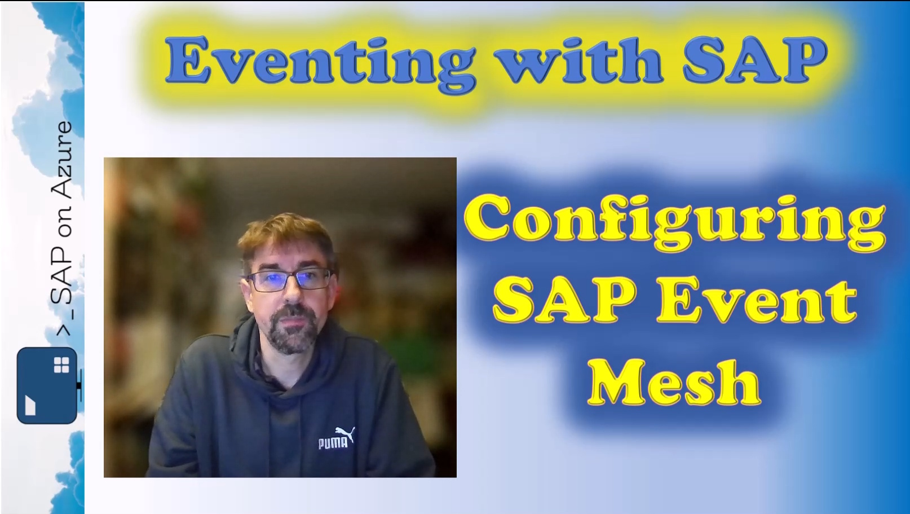

# Eventing with SAP

Events are getting more and more important. In this repo we are going to explore different options to expose SAP events to other systems. 
On the SAP Discovery Center you can find three main services to help you with Event-Driven-Architectures, https://discovery-center.cloud.sap/servicessearch/Event-Driven%20Architecture
- SAP Event Mesh
- SAP Event Mesh in Integration Suite
- SAP Advanced Event Mesh

## Let's start with Event Mesh. 
You can find the end to end setup video here: 
[](https://youtu.be/E32dwoxnEHY)


### SAP Event Mesh Configuration
During the configuration of the SAP Event Mesh Service instance, you need to provide a configuration in JSON. Here is the structure that I used in the video
```json
{
    "emname": "eventMeshSandboxAzure",
    "namespace": "default/az/hbr",
    "version": "1.1.0",
    "resources": {
        "units": "10"
    },
    "options": {
        "management": true,
        "messagingrest": true,
        "messaging": true
    },
    "rules": {
        "topicRules": {
            "publishFilter": [
                "${namespace}/*"
            ],
            "subscribeFilter": [
                "${namespace}/*"
            ]
        },
        "queueRules": {
            "publishFilter": [
                "${namespace}/*"
            ],
            "subscribeFilter": [
                "${namespace}/*"
            ]
        }
    },
    "xs-security": {
        "oauth2-configuration": {
            "credential-types": ["binding-secret","x509"]
        }
    }
}
```

### Configuring the SAP S/4HANA System
On the SAP side you need to configure the channel using transaction
```text
/IWXBE/CONFIG - Channel Configuration
```


Other useful transactions to trace and troubleshoot the configuration are

| Transaction | Text |
| ------------- | ------------- |
| SWELS | Activate Event Trace |
| SWEL | Event Trace |
| SMWS | Websocket logs |
